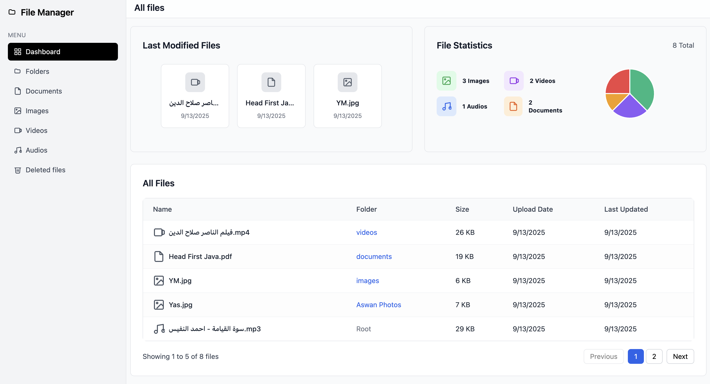

# File Explorer - Modern File Management System

A modern, responsive file management system built with Next.js 13, featuring an intuitive interface for organizing and managing files and folders. This application provides a seamless experience for file organization, with support for various file types and nested folder structures.

## 🌟 Key Features

- **Interactive Dashboard** with file statistics and recent activities
- **Hierarchical Folder Structure** with unlimited nesting
- **File Type Categorization** (Documents, Images, Videos, Audio)
- **Breadcrumb Navigation** for easy folder traversal
- **Real-time File Operations** (Create, Edit, Delete)
- **Modern UI/UX** with responsive design
- **File Size Visualization** and statistics

## 🖼️ Screenshots

### Dashboard View


Modern dashboard showing file statistics, recent files, and a comprehensive file list.

### Root Folder View


Main folder view with grid layout and quick actions.

### Nested Folder Structure


Support for unlimited folder nesting with breadcrumb navigation.

### File Management


Easy file editing with modal interface.


Secure file deletion with confirmation.

## 🏗️ Application Architecture

### Folder Structure

```
├── app/                    # Next.js 13 App Router
│   ├── (modules)/         # Main application modules
│   │   ├── dashboard/     # Dashboard page
│   │   ├── folders/       # Folder views
│   │   ├── files/        # File type specific views
│   ├── api/              # API routes
├── components/           # React components
│   ├── business/        # Business logic components
│   ├── shared/          # Reusable components
│   ├── ui/              # UI primitives
├── lib/                 # Utilities and helpers
└── public/              # Static assets
```

## 🛠️ Technology Stack

- **Framework**: Next.js 13 (App Router)
- **Language**: TypeScript
- **Styling**: Tailwind CSS
- **State Management**: React Hooks
- **UI Components**:
  - Shadcn UI
  - Radix UI primitives
- **Icons**: Lucide React
- **File System**: Custom in-memory implementation

## 🎯 Problem Solving

This application addresses several common file management challenges:

1. **Organization**:

   - Hierarchical folder structure
   - File type categorization
   - Quick access to recent files

2. **Navigation**:

   - Breadcrumb trail for deep nesting
   - Quick return to parent folders
   - Intuitive grid/list views

3. **File Operations**:

   - Drag-and-drop file uploads
   - Bulk operations
   - Quick edit and delete

4. **Visual Feedback**:
   - File type indicators
   - Size visualization
   - Operation confirmations

## 🚀 Getting Started

1. Clone the repository:

```bash
git clone https://github.com/your-username/file-explorer.git
```

2. Install dependencies:

```bash
npm install
```

3. Start the development server:

```bash
npm run dev
```

4. Open [http://localhost:3000](http://localhost:3000) in your browser.

## 💡 Usage

- Use the sidebar to navigate between different file types
- Click on folders to explore their contents
- Use the "+" button to create new files or folders
- Click on file/folder cards for quick actions
- Use the dashboard for an overview of your files

## 📝 Notes

- The application uses an in-memory store, so data will reset when the server restarts
- File sizes are simulated for demonstration purposes
- Supports common file types: documents, images, videos, and audio files

## 🔜 Future Enhancements

- [ ] Real database integration
- [ ] File preview functionality
- [ ] Search capabilities
- [ ] File sharing features
- [ ] Cloud storage integration
- [ ] Collaborative features

## 📄 License

This project is licensed under the MIT License - see the [LICENSE](LICENSE) file for details.
